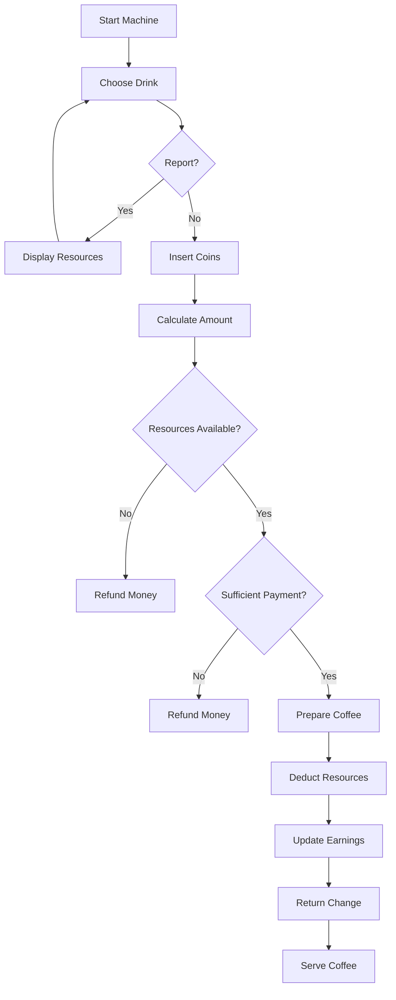

# ☕ Coffee Machine Simulator (Python)


A simple yet interactive **Coffee Machine Simulator** built using Python. This project mimics the behavior of a real coffee vending machine by managing resources, processing payments, dispensing drinks, and generating machine reports.

---

# 📌 Table of Contents

* 🚀 Features
* ☕ Available Drinks
* 💰 Coin System
* 🧠 Machine Workflow
* ⚙️ Initial Resources
* 🛠️ Tech Stack
* ▶️ How to Run
* 📸 Example Session
* 🎯 Learning Outcomes
* 🔮 Future Improvements
* 🤝 Contributing
* 👨‍💻 Author
* ⭐ Support

---

# 🚀 Features

| Feature                    | Description                                            |
| -------------------------- | ------------------------------------------------------ |
| ☕ Multiple Coffee Types    | Espresso, Latte, and Cappuccino                        |
| 💰 Coin Payment System     | Accepts Penny, Nickel, Dime, and Quarter               |
| 💵 Automatic Change Return | Calculates and returns extra money                     |
| 📊 Machine Reports         | Displays available resources and earnings              |
| 🥛 Resource Tracking       | Tracks milk, coffee, and water usage                   |
| 🔄 Continuous Ordering     | Allows multiple orders in a single session             |
| 🚫 Refund System           | Returns money if payment or resources are insufficient |

---

# ☕ Available Drinks

| Drink        | Price |
| ------------ | ----- |
| ☕ Espresso   | $3.00 |
| 🥛 Latte     | $4.50 |
| ☕ Cappuccino | $6.00 |

---

# 💰 Coin System

| Coin    | Value |
| ------- | ----- |
| Penny   | $0.01 |
| Nickel  | $0.05 |
| Dime    | $0.10 |
| Quarter | $0.25 |

---

# 🧠 Machine Workflow



---

# ⚙️ Initial Resources

| Resource | Quantity |
| -------- | -------- |
| 🥛 Milk  | 750 mL   |
| ☕ Coffee | 200 g    |
| 💧 Water | 800 mL   |
| 💵 Money | $0       |

---

# 🛠️ Tech Stack

| Technology           | Purpose                   |
| -------------------- | ------------------------- |
| 🐍 Python 3          | Core programming language |
| ⌨️ CLI               | User interaction          |
| 🔀 Functions         | Modular code structure    |
| 🧠 Conditional Logic | Decision making           |
| 🔁 Loops             | Continuous operation      |

---

# ▶️ How to Run

### 1️⃣ Clone Repository

```bash
git clone https://github.com/just-prem22/coffee-machine-simulator.git
```

### 2️⃣ Navigate to Project Folder

```bash
cd coffee-machine-simulator
```

### 3️⃣ Run the Program

```bash
python main.py
```

---

# 📸 Example Session

```text
What would you like to have (espresso/latte/cappuccino)

latte

How much penny you are inserting 0
How much nickel you are inserting 0
How much dimes you are inserting 10
How much quarter you are inserting 20

Your latte is ready...Enjoy your day

The exchange of $1.50 has been returned successfully
```

---

# 📊 Report Command

Type:

```text
report
```

Example Output:

```text
Total milk we have = 650
Total coffee we have = 130
Total Water we have = 670
Total money we have is 4.5
```

---

# 🎯 Learning Outcomes

| Concept                   | What I Learned                         |
| ------------------------- | -------------------------------------- |
| 🧩 Functions              | Creating reusable blocks of code       |
| 🔀 Conditional Statements | Decision making using if-else          |
| 🔁 Loops                  | Running repeated operations            |
| ⌨️ User Input             | Handling user interactions             |
| 📊 Resource Management    | Tracking inventory and earnings        |
| 🧠 Problem Solving        | Building real-world logic using Python |

---

# 🔮 Future Improvements

* 🏗️ Convert project into Object-Oriented Programming (OOP)
* 📂 Save machine data using files
* 🖥️ Build a graphical user interface (GUI)
* 📈 Add sales analytics
* 🔔 Low resource alerts
* 🔄 Refill resource functionality

---

# 🤝 Contributing

Contributions are welcome!

Feel free to:

* Fork this repository
* Create a new feature branch
* Improve functionality
* Fix bugs
* Enhance documentation

Let's learn and build together 🚀

---

# 👨‍💻 Author

## Prem Kumar

🎓 Student Developer

💡 Passionate about programming, problem solving, and building projects that help people.

> "Keep building. Keep learning. Keep going beyond."

---

# ⭐ Support

If you found this project helpful:

* ⭐ Star the repository
* 🍴 Fork the project
* 🛠️ Contribute improvements
* 📢 Share it with others

Every contribution and star motivates me to build more projects and continue learning.
