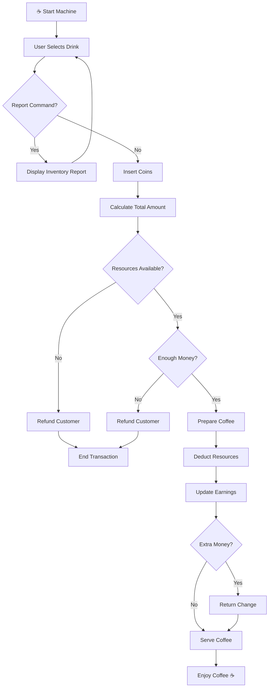

# ☕ Coffee Machine Simulator (Python)


A realistic **command-line coffee vending machine simulator** built using Python.

This project demonstrates how real-world vending machines manage **inventory, payments, refunds, resource tracking, and order processing** while providing an interactive user experience.

---

# 📌 Table of Contents

* 🚀 Features
* ☕ Coffee Menu
* 💰 Coin System
* 🧠 Machine Workflow
* ⚙️ Resource Management
* 🛠️ Tech Stack
* ▶️ How to Run
* 📸 Example Session
* 📊 Report System
* 🎯 Learning Outcomes
* 🔮 Future Improvements
* 🤝 Contributing
* 📜 License
* 👨‍💻 Author
* ⭐ Support

---

# 🚀 Features

| Feature                   | Description                                         |
| ------------------------- | --------------------------------------------------- |
| ☕ Multiple Coffee Options | Espresso, Latte, and Cappuccino                     |
| 💰 Coin Processing        | Accepts Penny, Nickel, Dime, and Quarter            |
| 💵 Change Calculation     | Automatically returns extra money                   |
| 🥛 Resource Tracking      | Tracks milk, coffee, and water usage                |
| 📊 Report Generation      | Displays machine inventory and earnings             |
| 🚫 Refund System          | Refunds money if payment/resources are insufficient |
| 🔄 Continuous Ordering    | Allows multiple coffee orders in one session        |
| ⚡ Real-Time Feedback      | Instant updates during ordering process             |

---

# ☕ Coffee Menu

<table>
<thead>
<tr>
<th>☕ Coffee Type</th>
<th>💲 Price</th>
<th>🥛 Milk</th>
<th>☕ Coffee</th>
<th>💧 Water</th>
</tr>
</thead>

<tbody>
<tr>
<td><strong>Espresso</strong></td>
<td>$3.00</td>
<td>80 mL</td>
<td>50 g</td>
<td>100 mL</td>
</tr>

<tr>
<td><strong>Latte</strong></td>
<td>$4.50</td>
<td>100 mL</td>
<td>70 g</td>
<td>130 mL</td>
</tr>

<tr>
<td><strong>Cappuccino</strong></td>
<td>$6.00</td>
<td>130 mL</td>
<td>80 g</td>
<td>150 mL</td>
</tr>

</tbody>
</table>

---

# 💰 Coin System

<table>
<thead>
<tr>
<th>🪙 Coin</th>
<th>💲 Value</th>
<th>📌 Description</th>
</tr>
</thead>

<tbody>

<tr>
<td>Penny</td>
<td>$0.01</td>
<td>1 Cent</td>
</tr>

<tr>
<td>Nickel</td>
<td>$0.05</td>
<td>5 Cents</td>
</tr>

<tr>
<td>Dime</td>
<td>$0.10</td>
<td>10 Cents</td>
</tr>

<tr>
<td>Quarter</td>
<td>$0.25</td>
<td>25 Cents</td>
</tr>

</tbody>
</table>

---

# 🧠 Machine Workflow



---

# ⚙️ Resource Management

The machine starts with the following resources:

<table>
<thead>
<tr>
<th>📦 Resource</th>
<th>🔢 Quantity</th>
</tr>
</thead>

<tbody>

<tr>
<td>🥛 Milk</td>
<td>750 mL</td>
</tr>

<tr>
<td>☕ Coffee</td>
<td>200 g</td>
</tr>

<tr>
<td>💧 Water</td>
<td>800 mL</td>
</tr>

<tr>
<td>💵 Earnings</td>
<td>$0</td>
</tr>

</tbody>
</table>

---

# 🛠️ Tech Stack

<table>
<thead>
<tr>
<th>⚙️ Technology</th>
<th>💡 Purpose</th>
</tr>
</thead>

<tbody>

<tr>
<td><strong>🐍 Python 3</strong></td>
<td>Core programming language</td>
</tr>

<tr>
<td><strong>⌨️ CLI Interface</strong></td>
<td>User interaction and order placement</td>
</tr>

<tr>
<td><strong>🔀 Conditional Logic</strong></td>
<td>Payment and inventory validation</td>
</tr>

<tr>
<td><strong>🔁 Loops</strong></td>
<td>Continuous machine operation</td>
</tr>

<tr>
<td><strong>🧩 Functions</strong></td>
<td>Modular code structure</td>
</tr>

</tbody>
</table>

---

# ▶️ How to Run

<table>
<thead>
<tr>
<th>🚀 Step</th>
<th>💻 Command</th>
<th>📌 Description</th>
</tr>
</thead>

<tbody>

<tr>
<td><strong>1️⃣ Clone Repository</strong></td>
<td><code>git clone https://github.com/just-prem22/coffee-machine-simulator.git</code></td>
<td>Download the project</td>
</tr>

<tr>
<td><strong>2️⃣ Open Folder</strong></td>
<td><code>cd coffee-machine-simulator</code></td>
<td>Navigate into project directory</td>
</tr>

<tr>
<td><strong>3️⃣ Run Program</strong></td>
<td><code>python main.py</code></td>
<td>Launch the coffee machine</td>
</tr>

</tbody>
</table>

---

# 📸 Example Session

```text
What would you like to have (espresso/latte/cappuccino)

latte

How much penny you are inserting 0
How much nickel you are inserting 0
How much dimes you are inserting 10
How much quarter you are inserting 20

Your latte is ready...Enjoy your day

The exchange of $1.50 has been returned successfully
```

---

# 📊 Report System

Type:

```text
report
```

to display machine statistics.

Example:

```text
Total milk we have = 650

Total coffee we have = 130

Total Water we have = 670

Total money we have is 4.5
```

---

# 🎯 Learning Outcomes

<table>
<thead>
<tr>
<th>📚 Concept</th>
<th>💡 What I Learned</th>
</tr>
</thead>

<tbody>

<tr>
<td><strong>🔀 Conditional Logic</strong></td>
<td>Building real-world decision-making systems</td>
</tr>

<tr>
<td><strong>🔁 Loops</strong></td>
<td>Running continuous machine operations</td>
</tr>

<tr>
<td><strong>🧩 Functions</strong></td>
<td>Creating reusable and maintainable code</td>
</tr>

<tr>
<td><strong>⌨️ User Input Handling</strong></td>
<td>Processing real-time customer interactions</td>
</tr>

<tr>
<td><strong>📊 Resource Tracking</strong></td>
<td>Managing inventory like real vending machines</td>
</tr>

<tr>
<td><strong>🧠 Problem Solving</strong></td>
<td>Designing business logic and workflows</td>
</tr>

</tbody>
</table>

💡 *This project strengthened my understanding of how real-world machines process transactions and manage resources.*

---

# 🔮 Future Improvements

* 🏗️ Convert project to Object-Oriented Programming (OOP)
* 💾 Save earnings and resources to files
* 🖥️ Build a graphical user interface (GUI)
* 📈 Add sales analytics dashboard
* 🔔 Low-resource alerts
* 🔄 Refill functionality

---

# 🤝 Contributing

Contributions are always welcome!

Whether you're a beginner learning Python or an experienced developer looking to improve the project, feel free to contribute.

### Steps to contribute:

* Fork this repository
* Create a new branch
* Implement your feature or fix
* Commit your changes
* Submit a Pull Request

Let's build and learn together 🚀

---

# 📜 License

<div align="center">

### 🛡️ MIT License

This project is licensed under the **MIT License**.

</div>

---

### 🔓 What this means

* ✅ Use the project freely
* ✅ Modify the code
* ✅ Distribute your own versions
* ✅ Use commercially

Just provide proper attribution.

---

# 👨‍💻 Author

<div align="center">

## Prem Kumar

🎓 Student Developer

💡 Passionate about programming, development, and solving real-world problems through technology.

</div>

---

### 🌟 About Me

* 🎓 Student exploring software development
* ☕ Building projects to improve problem-solving skills
* 🚀 Learning Python, Web Development, Flutter, and more

> *"Keep building. Keep learning. Keep going beyond."*

---

# ⭐ Support

<div align="center">

### 💙 Show Your Support

If you found this project useful, consider supporting it.

</div>

---

### 🚀 Ways to Support

* ⭐ Star the repository
* 🍴 Fork the project
* 🛠️ Contribute improvements
* 📢 Share it with others

---

✨ Every star motivates me to build better projects and learn more every day.
